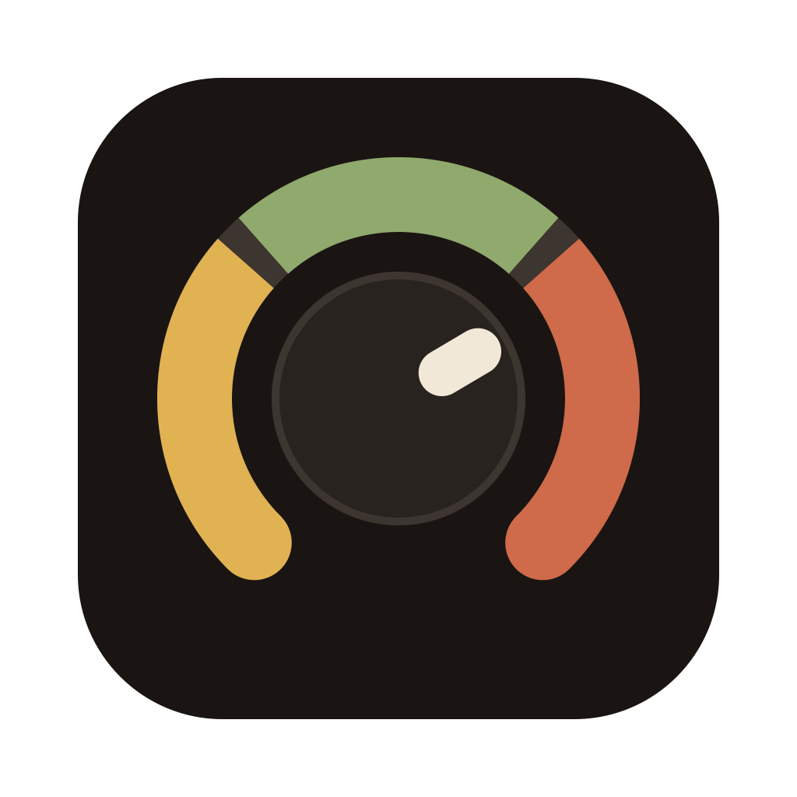
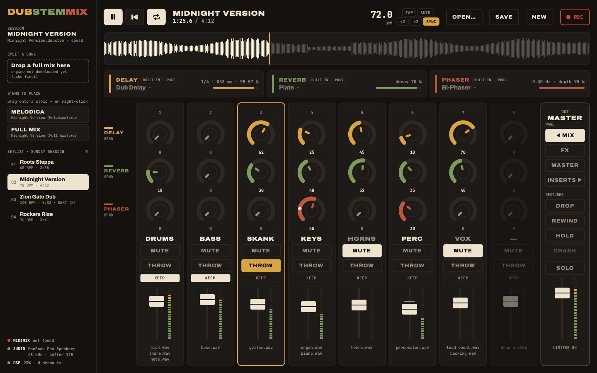
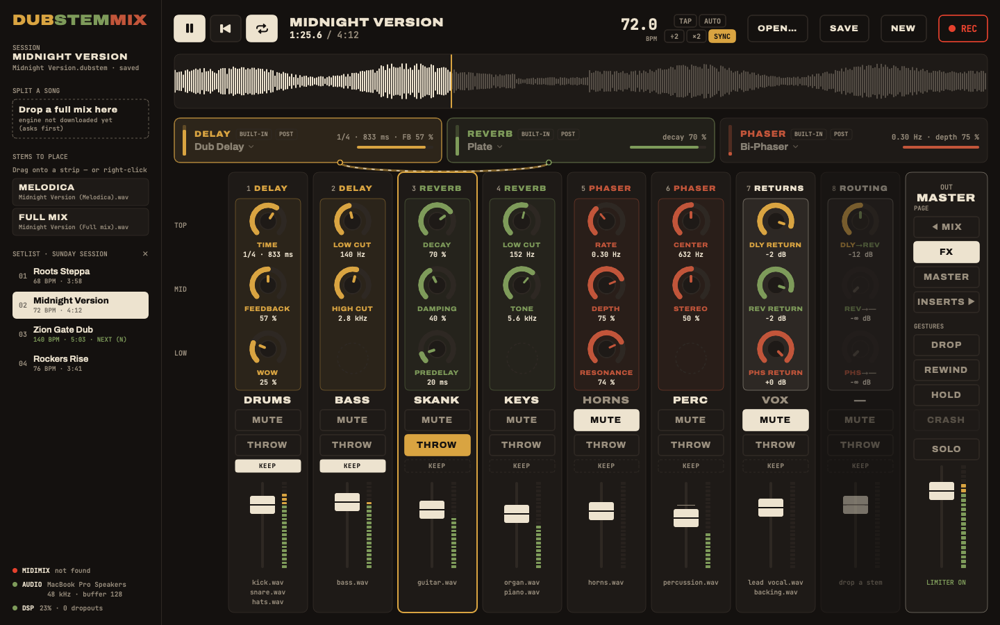
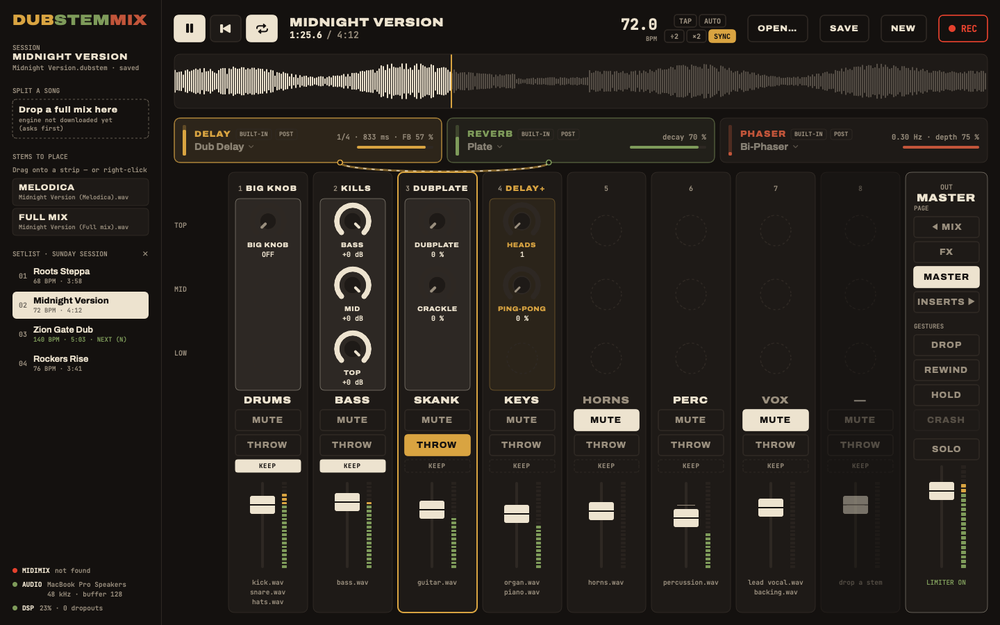
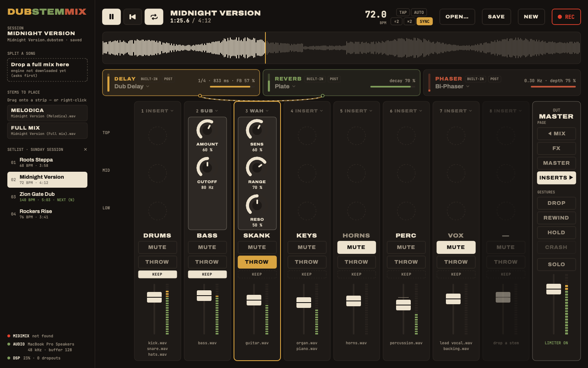
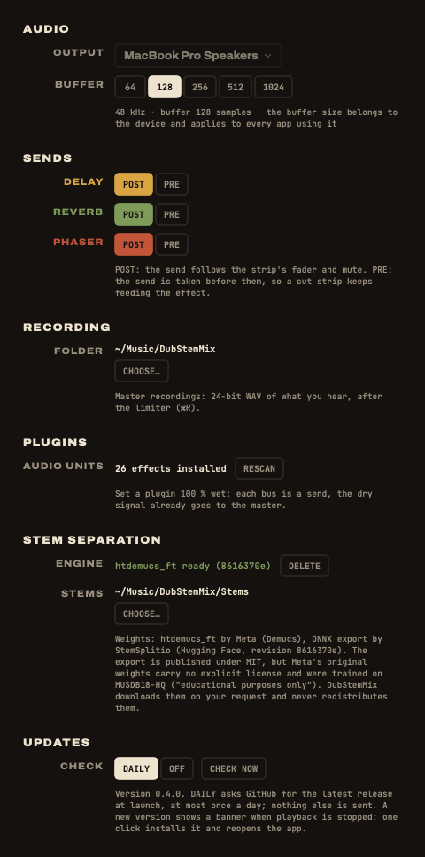

<p align="center"></p>

# DubStemMix

**Version excursion for the Akai MIDImix.** Take the stems of a tune, put them on eight faders, and cut your own version the way it was done at King Tubby's: pull the vocal, throw the snare into the echo, drop everything but bass and drums, let the spring crash. No DAW, no session to prepare, nothing to map. Plug the console, drop a folder of stems, play.

Free and open source (MIT). macOS 15 or later (built and tested on macOS 26), Apple Silicon.

<p align="center"></p>

## Install

One line, from the latest release. It installs (or updates) `DubStemMix.app` in `/Applications`, clears the Gatekeeper quarantine flag and opens the app:

```sh
curl -fsSL https://raw.githubusercontent.com/yoanbernabeu/DubStemMix/main/install.sh | sh
```

Or by hand: download `DubStemMix-<version>.zip` from the [releases](https://github.com/yoanbernabeu/DubStemMix/releases), unzip, move `DubStemMix.app` to `/Applications`.

**Gatekeeper.** The app is signed ad hoc, not notarized: no Apple Developer account behind it, just a selector with a Mac. On first launch macOS may say the app "cannot be opened". Two ways through:

- System Settings ▸ Privacy & Security, scroll down, **Open Anyway**;
- or, in a terminal: `xattr -dr com.apple.quarantine /Applications/DubStemMix.app` (this is what the install script does).

## The first riddim

1. **Plug in the MIDImix**, on its factory mapping. If you ever changed it with the Akai MIDImix Editor: File ▸ New, then Send to Hardware. The status line at the bottom left says "connected", and warns you if the console sends something the factory mapping does not know.
2. **Press SEND ALL** on the console. The app now knows where every knob and fader sits. Knobs are not motorized: after a page change, a knob acts once it reaches the value it now drives, shown as a cream "ghost" mark until then. No jumps, no surprises mid-tune.
3. **Drop a folder of stems** anywhere in the window, then drag each stem onto the strip you want (or right-click it). Nothing is placed for you: you decide what goes where, as you would patch a board. A file that is really the full mix stays in the pool.
4. **Play.** Space plays and pauses, Return goes back to the top, L loops the tune.

No stems? Drop a full song in **SPLIT A SONG** and get drums, bass, instruments and vocals on strips 1 to 4 (see below).

## The board

Eight strips, mirrored on screen so what you touch is where you look. Per strip: three knobs, MUTE, REC ARM, a fader. BANK LEFT / BANK RIGHT change what the knobs do; the faders stay strip volumes on every page.

| Page | Reach it | The knobs are |
|---|---|---|
| **MIX** | BANK LEFT (always comes back here) | sends to DELAY, REVERB, BUS 3 |
| **FX** | BANK RIGHT | the built-in effects: delay time, feedback, wow, filters, reverb decay, damping, tone, phaser rate, depth… and the three returns |
| **MASTER** | BANK RIGHT again | the big knob, the kills, the dubplate colour, delay heads and ping-pong |
| **INSERTS** | BANK RIGHT again | each strip's insert: sub, auto-wah, or a plugin's macros |

- **MUTE** cuts a strip; the LED shows the state. **SOLO held + MUTE** solos it, in place: the echo and reverb returns keep playing while everything else is gone.
- **REC ARM held** is the **dub throw**: the strip goes at full into the delay (or the reverb, or both, from the delay card's menu), taken before the fader and the mute. Throw a cut vocal, hear only its echo.
- Effects sit on shared buses, like the sends of a real board: cutting a strip never kills an echo or a reverb tail already on its way. That is the whole point.
- Sends are post-fader by default; Settings (⌘,) switch any bus to pre-fader for the classic move: fader down, echo still running.

<p align="center"></p>

## Gestures

Keyboard or the buttons in the master column. They never touch your mutes: release, and the mix is exactly as it was.

| Key | Gesture |
|---|---|
| **D** (hold) | **DROP**: everything cut but the strips marked KEEP. Mark bass and drums, hold D, you are on the riddim |
| **H** (hold) | **HOLD**: the delay closes on itself, input shut, feedback at unity. Cut all the rest, the echo keeps turning |
| **C** | **CRASH**: hit the spring. Perry's thunder, Tubby's spring shot (select Built-in · Spring on the REVERB card) |
| **R** | **Pull-up**: the selector's rewind. Tape brake on the whole master, back to the top, play |
| **T** | tap tempo · **N / P** next and previous tune of the setlist · **⌘R** record the master |

<p align="center"></p>

## The sound

Everything below is built in, with no plugin at all. The references are the ones you would expect.

- **Dub delay.** A tape echo: every pass, including the first, goes through the filters and the saturation, so repeats get darker and rounder. Feedback up to self-oscillation, held by the tape. Wow and flutter. Time in milliseconds or locked to the tempo (1/16 to 1/2, dotted included). Space Echo **head patterns** (1, 2, 3, 1+2, 2+3, 1+3, 1+2+3) and **ping-pong**.
- **Reverb.** A Dattorro **plate**, or a **spring** (a dispersive line: the transient comes out as a downward chirp, the boing) with the CRASH.
- **Bus 3.** A Bi-Phase style **phaser** (two six-stage phasers in series, resonance held by saturation, ±2.5 octaves) or a tape **flanger**. Both output only the shifted signal: summed with the strip's dry sound, they carve the comb.
- **Master chain.** The **big knob**: King Tubby's stepped high-pass from the MCI board, 20 Hz (off) to 10 kHz in twelve steps, no resonance, each step a plateau you hear. The **kills**: a sound-system isolator, BASS / MID / TOP, kill only, never boost, crossovers at 200 Hz and 2.5 kHz that sum flat. The **dubplate** colour: an acetate played a hundred times, bandwidth shrinking, tape saturation, a slow wobble, crackle to taste. And the **pull-up**.
- **Strip inserts.** A **sub-octave** generator (the dbx boom box idea: follow the bass, add the octave below) and an **auto-wah** in the Mu-Tron III style (louder opens the filter, or closes it in down mode).

Any **Audio Unit** effect can replace a built-in effect on a bus, or sit in a strip's insert. Plugins load out of process: one that crashes falls back to the built-in effect and stays in the project to be reloaded. On the FX page the bus's six knobs become macros you assign to the plugin's parameters, remembered per plugin.

Set a plugin on a **bus** 100 % wet: the dry signal already goes to the master through the strip. A plugin in an **insert** is in the direct path, set its mix as you like.

<p align="center"></p>

## Splitting a tune into stems

Drop a full song (WAV, MP3, AIFF, FLAC, M4A…) in **SPLIT A SONG** in the sidebar, or File ▸ Split a Song…. Drums, bass, instruments and vocals land on strips 1 to 4, the original goes to the pool for A/B listening. Stems are written as Float32 WAV in `~/Music/DubStemMix/Stems/` (changeable in Settings); a tune already split reopens without recomputing.

The separation runs on the CPU with [htdemucs_ft](https://github.com/facebookresearch/demucs) through ONNX Runtime. Count roughly 1.2× the song's length on an M3 Pro (a 5-minute tune takes about 6 minutes) and up to 9 GB of memory. The four model files (663 MB) are **not** in this repository, the releases or the app: they are downloaded from Hugging Face on first use, after asking you, into `~/Library/Application Support/DubStemMix/Models`. Their license status is described in [NOTICE](NOTICE).

## Projects, setlists, recording

- **Save** (⌘S) writes a `.dubstem` project: which stems on which strips, effect settings, plugins and their state, inserts, KEEP marks, tempo. Fader and knob positions are not restored: the console is the truth. Once saved, changes are saved automatically. Files are referenced by absolute and relative path, so a moved folder still opens.
- **Setlist** (`.dubset`): the sidebar lists the tunes of the set; N / P load the next or previous one, stopped at the top, while the effect tails of the previous tune keep going. Drag rows to reorder, double-click the title to rename.
- **REC** (⌘R) records the master, after the limiter, as 24-bit WAV in `~/Music/DubStemMix` (changeable in Settings): your version, ready to cut.

## Settings (⌘,)

Output device and buffer size (128 or 256 for the dance), recordings folder, pre/post-fader per bus, Audio Unit rescan, separation engine (download, delete) and stems folder. The status bar shows the device, the audio-thread load and the dropouts reported by the device.

<p align="center"></p>

## Known limits

- Plugin latency is not compensated. Fine on send buses (100 % wet), audible in an insert with a plugin that adds latency.
- Changing the effect of a bus or an insert stops the engine for a fraction of a second (effect tails are cut), then playback resumes where it was: AVAudioEngine cannot rewire while running.
- Dropping or removing a stem during playback causes a short gap; MUTE takes about 25 ms to close (the mixer's own ramp).
- macOS 14 is out: the engine uses the `Synchronization` module (macOS 15). Only macOS 26 has actually been tested.
- The MIDImix is the only controller in this version; the mapping lives in one file, other controllers can follow.

## Build from source

```sh
git clone https://github.com/yoanbernabeu/DubStemMix.git
cd DubStemMix
swift run DubStemMix          # runs the app from the package
tools/make-app.sh 0.1.1 dist  # builds dist/DubStemMix.app and the zip
swift test                    # 65 tests, no model or audio device needed
```

Needs Xcode 26 (Swift 6.2). Useful self-checks without the UI: `--check-documents`, `--check-audio`, `--check-plugins`, `--check-plugin-crash`, `--download-models`, `--split <file>`. The screenshots above come from `--snapshot <file.png> [--fx | --master | --inserts | --settings]`, rendered with demo data.

`PRD.md` is the product reference (in French): every decision, the console mapping, the milestones. `TODO.md` is what remains.

## License

MIT, see [LICENSE](LICENSE). Third-party notices, including the separation model's, in [NOTICE](NOTICE).

Made for the sound system, in the spirit of King Tubby, Lee "Scratch" Perry, Scientist and everyone who ever versioned a riddim on a four-track with a spring and a tape echo.
