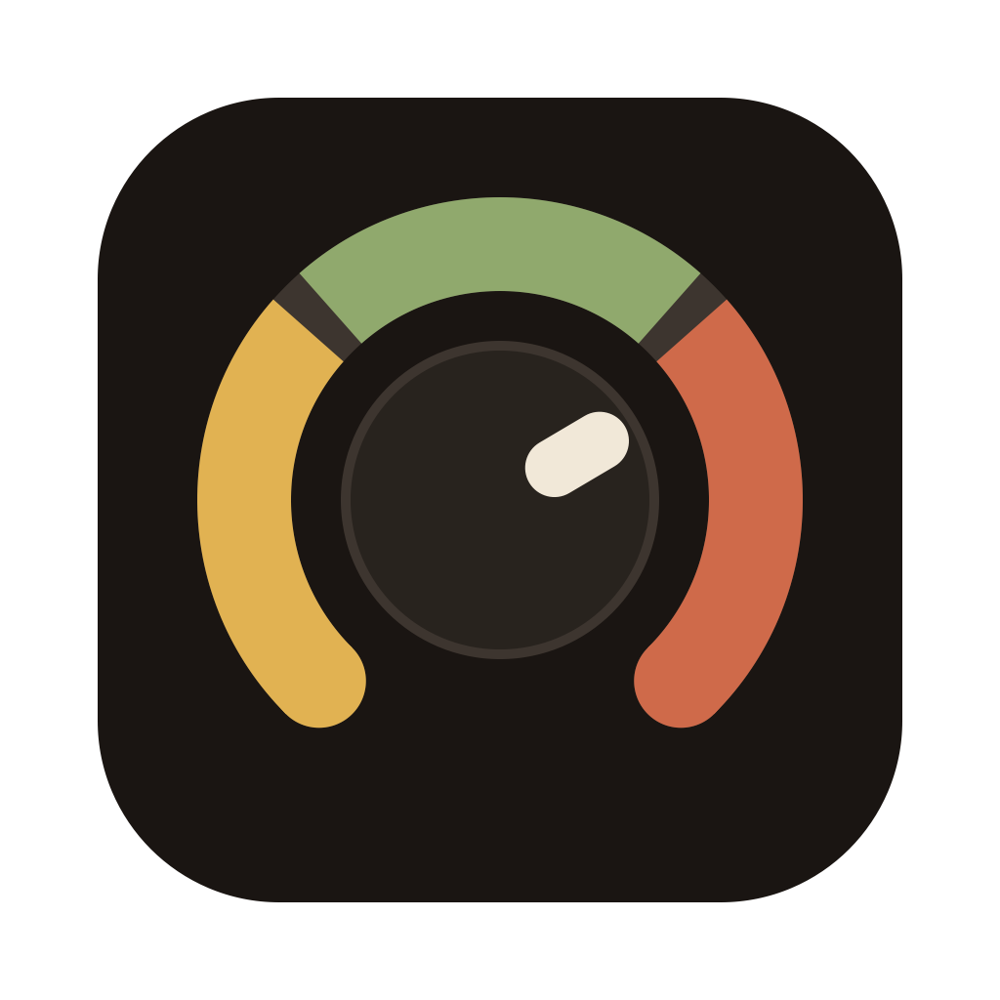
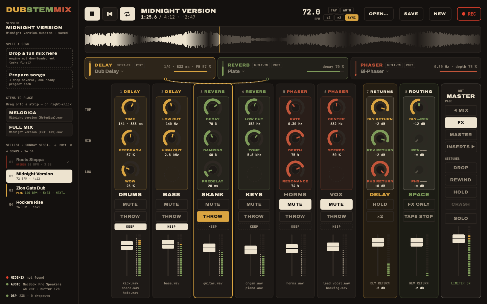
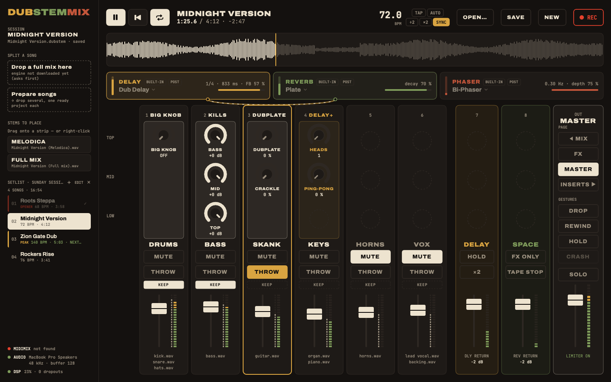
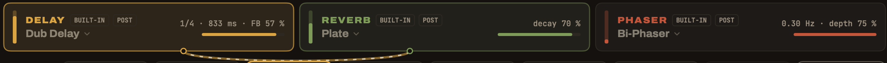
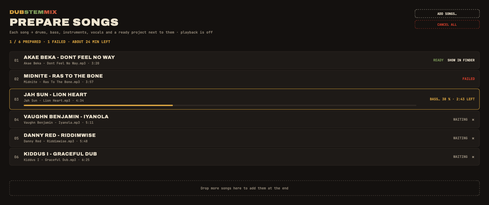
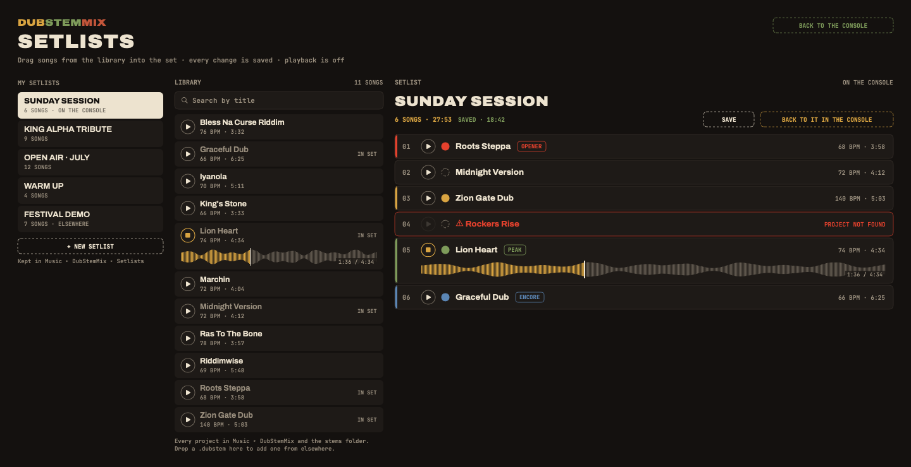

<p align="center"></p>

# DubStemMix

**Version excursion for the Akai MIDImix.** Take the stems of a tune, put them on six faders, keep two more to play the effects, and cut your own version the way it was done at King Tubby's: pull the vocal, throw the snare into the echo, drop everything but bass and drums, let the spring crash. No DAW, no session to prepare, nothing to map. Plug the console, drop a folder of stems, play.

Free and open source (MIT). macOS 15 or later (built and tested on macOS 26), Apple Silicon.

▶ [Watch it in action on YouTube](https://www.youtube.com/watch?v=k314RyG2htE)

<p align="center"></p>

## Install

One line, from the latest release. It installs (or updates) `DubStemMix.app` in `/Applications`, clears the Gatekeeper quarantine flag and opens the app:

```sh
curl -fsSL https://raw.githubusercontent.com/yoanbernabeu/DubStemMix/main/install.sh | sh
```

Or by hand: download `DubStemMix-<version>.zip` from the [releases](https://github.com/yoanbernabeu/DubStemMix/releases), unzip, move `DubStemMix.app` to `/Applications`.

**Gatekeeper.** The app is signed ad hoc, not notarized: no Apple Developer account behind it, just a selector with a Mac. On first launch macOS may say the app "cannot be opened". Two ways through:

- System Settings ▸ Privacy & Security, scroll down, **Open Anyway**;
- or, in a terminal: `xattr -dr com.apple.quarantine /Applications/DubStemMix.app` (this is what the install script does).

**Updates.** At launch, at most once a day, the app asks GitHub for the latest release; nothing else is sent. When a newer version is out, a banner shows in the top bar, only while playback is stopped: **UPDATE** downloads it, replaces the app where it is installed and reopens it. Turn the check off in Settings, or use Help ▸ Check for Updates… by hand.

## The first riddim

1. **Plug in the MIDImix**, on its factory mapping. If you ever changed it with the Akai MIDImix Editor: File ▸ New, then Send to Hardware. The status line at the bottom left says "connected", and warns you if the console sends something the factory mapping does not know.
2. **Press SEND ALL** on the console. The app now knows where every knob and fader sits. Knobs are not motorized: after a page change, a knob acts once it reaches the value it now drives, shown as a cream "ghost" mark until then. No jumps, no surprises mid-tune.
3. **Drop a folder of stems** anywhere in the window, then drag each stem onto the strip you want (or right-click it). Nothing is placed for you: you decide what goes where, as you would patch a board. A file that is really the full mix stays in the pool.
4. **Play.** Space plays and pauses, Return goes back to the top, L loops the tune.

No stems? Drop a full song in **SPLIT A SONG** and get drums, bass, instruments and vocals on strips 1 to 4 (see below).

## The board

Eight strips, mirrored on screen so what you touch is where you look: strips 1 to 6 hold the stems, strips 7 and 8 play the effects (see [The effect strips](#the-effect-strips)). Per strip: three knobs, MUTE, REC ARM, a fader. BANK LEFT / BANK RIGHT change what the knobs do; the stem faders stay strip volumes on every page.

| Page | Reach it | The knobs are |
|---|---|---|
| **MIX** | BANK LEFT (always comes back here) | sends to DELAY, REVERB, BUS 3 |
| **FX** | BANK RIGHT | the built-in effects: delay time, feedback, wow, filters, reverb decay, damping, tone, phaser rate, depth… the three returns and the bus-to-bus sends |
| **MASTER** | BANK RIGHT again | the big knob, the kills, the dubplate colour, delay heads and ping-pong |
| **INSERTS** | BANK RIGHT again | each strip's insert: sub, auto-wah, or a plugin's macros |

- **MUTE** cuts a strip; the LED shows the state. **SOLO held + MUTE** solos it, in place: the echo and reverb returns keep playing while everything else is gone.
- **REC ARM held** is the **dub throw**: the strip goes at full into the delay (or the reverb, or both, from the delay card's menu), taken before the fader and the mute. Throw a cut vocal, hear only its echo.
- Effects sit on shared buses, like the sends of a real board: cutting a strip never kills an echo or a reverb tail already on its way. That is the whole point.
- Sends are post-fader by default; Settings (⌘,) switch any bus to pre-fader for the classic move: fader down, echo still running.
- **Bus to bus**: any bus return can be patched into another bus, see [Patching the buses](#patching-the-buses).

### The effect strips

Strips 7 and 8 hold no stem: they put the effects under your hands without leaving the MIX page, so you can send the vocal into the delay with one hand and bend the echo with the other.

| | Strip 7 · DELAY | Strip 8 · SPACE |
|---|---|---|
| Top knob | delay speed (ms, or a division with SYNC) | phaser rate (bus 3) |
| Middle knob | delay feedback, up to self-oscillation | delay → its chosen bus |
| Bottom knob | reverb length | reverb → its chosen bus |
| Fader | delay return | reverb return |
| MUTE (hold) | **HOLD**: the delay loops on itself | **FX ONLY**: the dry sound leaves, the stems keep feeding the effects |
| REC ARM (hold) | **×2**: the delay goes twice as fast, the echoes jump an octave up | **TAPE STOP**: the delay's tape brakes to a standstill, and speeds up again when you let go |

The knobs are a second way to reach the FX page's settings: they catch the value up before acting, like any knob after a page change. On the other pages the knobs of strips 7 and 8 keep that page's role; their faders hold the returns on every page, so changing page never changes the sound. The LEDs stay lit while you hold a gesture. ×2 and TAPE STOP play the built-in delay (not a plugin on the delay bus).

<p align="center"></p>

## Gestures

Keyboard or the buttons in the master column (HOLD also on strip 7, and the effect strips' own gestures, see above). They never touch your mutes: release, and the mix is exactly as it was.

| Key | Gesture |
|---|---|
| **D** (hold) | **DROP**: everything cut but the strips marked KEEP. Mark bass and drums, hold D, you are on the riddim |
| **H** (hold) | **HOLD**: the delay closes on itself, input shut, feedback at unity. Cut all the rest, the echo keeps turning |
| **C** | **CRASH**: hit the spring. Perry's thunder, Tubby's spring shot (select Built-in · Spring on the REVERB card) |
| **R** | **Pull-up**: the selector's rewind. Tape brake on the whole master, back to the top, play |
| **Esc** | **PANIC**: the three buses emptied at once, echoes, tails and HOLD included, while the tune plays on. On the console: **BANK LEFT + BANK RIGHT** together |
| **T** | tap tempo · **N / P** next and previous tune of the setlist (while playing, they arm it: see [Playing live](#playing-live)) · **⌘R** record the master |

<p align="center"></p>

## The sound

Everything below is built in, with no plugin at all. The references are the ones you would expect.

- **Dub delay.** A tape echo: every pass, including the first, goes through the filters and the saturation, so repeats get darker and rounder. Feedback up to self-oscillation, held by the tape. Wow and flutter. Time in milliseconds or locked to the tempo (1/16 to 1/2, dotted included). Space Echo **head patterns** (1, 2, 3, 1+2, 2+3, 1+3, 1+2+3) and **ping-pong**.
- **Reverb.** A Dattorro **plate**, or a **spring** (a dispersive line: the transient comes out as a downward chirp, the boing) with the CRASH.
- **Bus 3.** A Bi-Phase style **phaser** (two six-stage phasers in series, resonance held by saturation, ±2.5 octaves) or a tape **flanger**. Both output only the shifted signal: summed with the strip's dry sound, they carve the comb.
- **Master chain.** The **big knob**: King Tubby's stepped high-pass from the MCI board, 20 Hz (off) to 10 kHz in twelve steps, no resonance, each step a plateau you hear. The **kills**: a sound-system isolator, BASS / MID / TOP, kill only, never boost, crossovers at 200 Hz and 2.5 kHz that sum flat. The **dubplate** colour: an acetate played a hundred times, bandwidth shrinking, tape saturation, a slow wobble, crackle to taste. And the **pull-up**.
- **Strip inserts.** A **sub-octave** generator (the dbx boom box idea: follow the bass, add the octave below) and an **auto-wah** in the Mu-Tron III style (louder opens the filter, or closes it in down mode).

Any **Audio Unit** effect can replace a built-in effect on a bus, or sit in a strip's insert. Plugins load out of process: one that crashes falls back to the built-in effect and stays in the project to be reloaded. On the FX page the bus's six knobs become macros you assign to the plugin's parameters, remembered per plugin.

Set a plugin on a **bus** 100 % wet: the dry signal already goes to the master through the strip. A plugin in an **insert** is in the direct path, set its mix as you like.

<p align="center"></p>

### Patching the buses

On a dub board you patch a return into a send, and the effects start feeding each other. DubStemMix does the same: each bus return can also feed one other bus.

- **Delay into the reverb**: the echoes drown in the space, each repeat a little further away.
- **Delay into the phaser or the flanger**: the repeats start to turn.
- **A filter plugin on bus 3, the delay sent into it**: a filtered echo. The order of your effects is which bus holds which.

Out of the box every bus stands on its own and feeds only the master. Pick a target in the bus card's **Send to** menu, then dose it with the three send knobs on strip 8 of the FX page (DLY→, REV→ and the bus 3 one, labelled with their target). Every bus can be sent into every other, and chains work (delay → phaser → reverb). Only targets that would close a loop are greyed out, so feedback between effects cannot run away.

Patching is a gesture: do it while playing, nothing is cut. The buses are never wired to one another in the audio graph; each return is handed to the other buses through memory, one audio buffer later (3 to 11 ms, lost in an echo or a reverb), so a patch is only a level that opens.

You see what you patched: a cable runs between the bus cards, dashed while its knob is at zero, with the signal travelling along it. Each card lights up in its colour while its effect sounds, tails included, and its colour bar shows what enters the bus.

<p align="center"></p>

## Splitting a tune into stems

Drop a full song (WAV, MP3, AIFF, FLAC, M4A…) in **SPLIT A SONG** in the sidebar, or File ▸ Split a Song…. Drums, bass, instruments and vocals land on strips 1 to 4, the original goes to the pool for A/B listening. Stems are written as Float32 WAV in `~/Music/DubStemMix/Stems/` (changeable in Settings); a tune already split reopens without recomputing.

The separation runs on the CPU with [htdemucs_ft](https://github.com/facebookresearch/demucs) through ONNX Runtime. Count roughly 1.2× the song's length on an M3 Pro (a 5-minute tune takes about 6 minutes) and up to 9 GB of memory. The four model files (663 MB) are **not** in this repository, the releases or the app: they are downloaded from Hugging Face on first use, after asking you, into `~/Library/Application Support/DubStemMix/Models`. Their license status is described in [NOTICE](NOTICE).

**A whole set at once.** Drop several songs, or a folder, in **PREPARE SONGS** under SPLIT A SONG, or File ▸ Prepare Songs…. They are split one after the other, and each one becomes a ready `.dubstem` project saved next to its stems: drums, bass, instruments and vocals on strips 1 to 4, the original in the pool, the tempo detected, the song's name as title. Nothing opens by itself. While the queue runs, the preparation screen replaces the console and playback is off. You can drop more songs onto it, remove or reorder the ones still waiting, or **CANCEL ALL** (finished songs stay on disk). The time left for the whole queue shows at the top. A file that fails is marked and the queue moves on to the next one. At the end, a macOS notification says how many songs are ready. Your open session is untouched: you find it again when you come back to the console.

<p align="center"></p>

## Projects, setlists, recording

- **Save** (⌘S) writes a `.dubstem` project: which stems on which strips, effect settings, plugins and their state, inserts, KEEP marks, tempo. Fader and knob positions are not restored: the console is the truth. Once saved, changes are saved automatically. Files are referenced by absolute and relative path, so a moved folder still opens.
- **Setlist** (`.dubset`): the sidebar lists the tunes of the set. Stopped, N / P (or a click on a row) load the next or previous one, at the top. While playing they arm it instead, see [Playing live](#playing-live). Drag rows to reorder, double-click the title to rename. Drop `.dubstem` files from the Finder onto the setlist to add them at the end; the total length of the set shows under its name. Build and change your sets in the [setlist workshop](#building-a-set). **New Setlist…** and **Save Setlist As…** are in the File menu.
- **Rename a tune**: double-click its title in the top bar, or right-click a setlist row → Rename…. The title you type is kept in the project.
- **Take the set to another Mac**: **File → Export Setlist…** creates a new folder with the setlist and, for each tune, its project and every one of its files. Copy it anywhere, double-click the setlist, play. Audio Unit plugins can't be copied: `PLUGINS.txt` lists the ones to install (without them, the built-in effects stand in).
- **The setlist's rack.** In a setlist, what is patched on the buses (the reverb and bus 3 effects, the bus-to-bus sends, the plugins on the buses) belongs to the setlist, not to each tune: the echo and the spring stay wired all night, like on a sound system. Each tune brings its stems, its effect settings, its tempo, its KEEP marks and its inserts, never a rewiring, so the tails of one tune ring into the next. The first tune opened gives the setlist its rack; change it while playing and the setlist keeps it. A tune prepared with another rack keeps it in its own file (shown `≠ RACK` in the list) and is played through the setlist's.
- **The limiter is yours.** The master's safety limiter can be switched off: click `LIMITER ON` under the master fader (and again to bring it back). Instant, even while playing, remembered on this Mac. Without it, nothing stops the output or the recording from clipping above 0 dB: watch the red top of the master meter.
- **Open Recent**: File ▸ Open Recent lists the last 10 projects and setlists you opened, newest first; a file that is gone is hidden until it comes back. The same list shows on a right-click on the Dock icon. Songs opened from the open setlist are not added: the setlist brings you back to them.
- **REC** (⌘R) records the master, after the limiter, as 24-bit WAV in `~/Music/DubStemMix` (changeable in Settings): your version, ready to cut.

## Building a set

**EDIT** at the top of the setlist in the sidebar, or File ▸ Setlists…, opens the setlist workshop in place of the console (playback stops, your session stays open). Three columns:

- **My setlists**: every setlist kept in Music ▸ DubStemMix ▸ Setlists. New, rename (double-click), duplicate, delete (to the Trash: the songs are not touched). A setlist kept elsewhere shows as `ELSEWHERE` and can be moved into the folder.
- **Library**: every project in Music ▸ DubStemMix and in your stems folder, with its tempo and length, and a search by title. Drop a `.dubstem` from the Finder onto it to add one kept elsewhere: the library remembers it.
- **The setlist**: drag songs from the library onto a line to put them there, or anywhere else in the column to add them at the end (double-click in the library works too). Drag lines to reorder; ⌫ or a right-click removes one. A song is never twice in the same set: its line blinks instead. Each line can have a **colour** (click the dot) and a **tag** (right-click), for this set only: the same song can open one set in red and close another one in green.

▶ on any line plays the song's stems summed, raw, without effects, on the console's output (so on the sound system if it is plugged in); click in its waveform to jump anywhere. A song whose project is gone shows in red with ⚠, here and in the sidebar: right-click ▸ **Locate…**.

Every change is saved at once (`SAVED · 18:42`); **SAVE** (⌘S) saves once more. **LOAD IN THE CONSOLE** makes the setlist the console's and goes back to it, without opening a song: N or a click starts where you want.

<p align="center"></p>

## Playing live

- **A request in the middle of the set.** The **+** at the top of the setlist opens the library with a search: the song you pick goes in just after the one playing, without touching the music. Lines show their colour and tag; reorder with a right-click (Move up / Move down) or by dragging.
- **Already played.** A tune played for 30 seconds or more this session is greyed with a ✓, still clickable. Forgotten when the app quits; nothing is written in the setlist.
- **Signal before the fader.** Next to each strip's meter, a thin grey bar shows what its stems give before the fader and the mute: fader down or muted, you see whether the vocal or the horns are playing right now, and open on time.
- **The end of the tune, visible.** The time left shows next to the clock, and the waveform turns orange in the last 30 seconds: time to arm the next tune.
- **The next tune, armed.** While a tune plays, N / P (or a click on a row of the setlist) arm the next one: it blinks on the waveform, nothing is cut. **Space** drops it: the current tune stops dead, the armed one starts from the top, the effect tails go on. **R** pulls up into it: tape brake, then the next tune. N / P again arm another one; a click on the current tune cancels.
- **Effects change while playing.** Plate ↔ spring and phaser ↔ flanger switch without a gap: the new effect takes the input, the old one rings out its tail. Built-in strip inserts (sub, auto-wah) crossfade in 10 ms.
- **Effects change while playing.** Re-patching the buses (the **Send to** menus) is live too, without a cut.
- **Nothing cuts the sound by mistake.** While playing, what would stop the engine or leave a gap is refused, with a word in the top bar: loading or removing a plugin, putting a stem on a strip or taking one off. A plain click on the waveform no longer jumps (double-click or ⌥-click does). Quitting, closing the window, New Session or opening another project ask first.
- **Checked before the set.** The setlist looks for every tune's stems and plugins when it opens and each time you come back to the app (a disk plugged in meanwhile): a tune with a problem is marked ⚠, its tooltip says what. **LOCATE MISSING STEMS…** takes one folder for the whole setlist and finds the stems by name in it and its subfolders.
- **The screen stays on** while playing, even when only the console is touched.

## Settings (⌘,)

Output device and buffer size (128 or 256 for the dance), recordings folder, pre/post-fader per bus, Audio Unit rescan, separation engine (download, delete) and stems folder, daily update check on or off. The status bar shows the device, the audio-thread load and the dropouts reported by the device.

<p align="center"></p>

## Known limits

- Plugin latency is not compensated. Fine on send buses (100 % wet), audible in an insert with a plugin that adds latency.
- Loading or removing a plugin, on a bus or in an insert, stops the engine for a fraction of a second (effect tails are cut): AVAudioEngine cannot rewire while running. So it waits for playback to stop. Moving from one tune to the next still cuts the tails when a strip's insert plugin changes (the armed tune says so); the same plugin on the same strip in both tunes stays plugged in, only its settings change.
- Putting a stem on a strip or taking one off leaves a short gap, so it waits for the stop too. MUTE takes about 25 ms to close (the mixer's own ramp).
- macOS 14 is out: the engine uses the `Synchronization` module (macOS 15). Only macOS 26 has actually been tested.
- The MIDImix is the only controller in this version; the mapping lives in one file, other controllers can follow.

## FAQ

**Only the Akai MIDImix?** Today, yes: it is the console this was built and tested with. But the mix logic never sees the MIDImix. It receives abstract events (knob on strip 3, row 2; MUTE on strip 5; BANK RIGHT) and sends abstract LED states back. The MIDImix itself is a **profile**, plain data: which control change is which knob, which note is which button, which notes light the LEDs. See `ControllerProfile` in `Sources/DubStemMixCore/MidiMix.swift`.

**Adding another controller.** If it has the same geometry (8 strips with 3 knobs, a fader and buttons for MUTE / SOLO / REC ARM, two bank buttons, a master fader), write a profile: the tables of CC and note numbers, the fragment of its MIDI name, whether it has LEDs. Add it to `ControllerProfile.all`, check the numbers with `tools/midi-monitor.swift`, open a pull request. The Novation Launch Control XL is the obvious candidate. A controller with a different shape (one knob per strip, no per-strip buttons) needs changes in the interface and the mix logic, not just a profile: open an issue first so we can talk about it.

**No controller at all?** Everything works with the mouse and the keyboard: knobs, faders, MUTE (⌥-click for solo), THROW, pages, gestures. The console adds the hands.

**Intel Macs?** The releases are built for Apple Silicon and nothing has been tested on Intel. Building from source may work; no promise.

**Why does macOS complain at first launch?** The app is signed ad hoc, not notarized: no Apple Developer account. Open Anyway once, or use the install script.

**Where does the separation model live, and how do I remove it?** `~/Library/Application Support/DubStemMix/Models`, 663 MB. Settings ▸ Stem separation ▸ Delete. It is never bundled with the app.

**Which stems can I load?** Any audio files (WAV, AIFF, FLAC, MP3, M4A, CAF), any sample rate, any length; several stems can share a strip. Stems exported from a DAW, bought as multitracks, or split by the app itself.

**Latency?** Set the buffer to 128 or 256 samples in Settings. Built-in effects add no latency; a plugin's latency is not compensated.

## Build from source

```sh
git clone https://github.com/yoanbernabeu/DubStemMix.git
cd DubStemMix
swift run DubStemMix          # runs the app from the package
tools/make-app.sh 0.11.0 dist  # builds dist/DubStemMix.app and the zip
swift test                    # 109 tests, no model or audio device needed
```

Needs Xcode 26 (Swift 6.2). Useful self-checks without the UI: `--check-documents`, `--check-audio`, `--check-plugins`, `--check-plugin-crash`, `--download-models`, `--split <file>` (add `--project` to also write the song's ready project next to its stems), `--check-prepare <out dir> <files…>` (runs the preparation queue on these files, then a second queue cancelled after 5 s). The screenshots above come from `--snapshot <file.png> [--fx | --master | --inserts | --settings | --prepare | --setlists]`, rendered with demo data.

`PRD.md` is the product reference (in French): every decision, the console mapping, the milestones. `TODO.md` is what remains.

## License

MIT, see [LICENSE](LICENSE). Third-party notices, including the separation model's, in [NOTICE](NOTICE).

Made for the sound system, in the spirit of King Tubby, Lee "Scratch" Perry, Scientist and everyone who ever versioned a riddim on a four-track with a spring and a tape echo.
