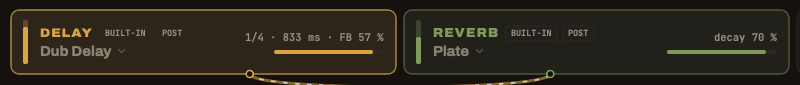
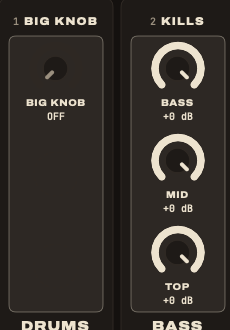

By the end of this page you will have played a dub version of a tune and recorded it: the riddim alone, a vocal thrown into the echo, a spring crash, a rewind. Ten steps, one move each.

Everything works with the **Akai MIDImix** or with the **mouse and keyboard**: each step says both.

## Before you start

- **DubStemMix installed.** One line in the terminal, see [Install and plug in](../install/).
- **The stems of a tune**: separate audio files for the drums, the bass, the guitar, the vocal… Exported from a DAW, bought as multitracks, or made by the app from a full song (step 2).
- **The MIDImix**, if you have one. Not required.

## 1. Plug in the console

Plug the MIDImix in USB, before or after opening the app. At the bottom left, the status line reads **MIDIMIX connected**.

Here it reads *not found*: no console is plugged in. The app works anyway, with the mouse.

Then press **SEND ALL** on the console. The app reads where every knob and fader sits, and the screen matches your hands.

> **It says "custom mapping?"** The console was changed with the Akai MIDImix Editor. In the editor: File ▸ New, then Send to Hardware. That brings back the factory mapping, the one DubStemMix expects.

The knobs of the MIDImix are not motorized. When a knob gets a new job (step 8), it acts only once you turn it to the value it now drives. Until then a dashed cream mark shows where to go. Nothing jumps in the middle of the tune.

## 2. Load the stems

Drop the folder of stems anywhere in the window. The files line up in the sidebar, under **STEMS TO PLACE**. Drag each one onto a strip, or right-click it to pick the strip.

Nothing is placed for you: you patch the board. A layout that works for most reggae tunes:

| Strip | Stem |
|---|---|
| 1 | drums (kick, snare and hats can share the strip) |
| 2 | bass |
| 3 | skank: the offbeat guitar or keys |
| 4 | keys, organ |
| 5 | horns |
| 6 | vocal |

**No stems?** Drop the full song on **Drop a full mix here**, under SPLIT A SONG. Drums, bass, instruments and vocals land on strips 1 to 4. The first time, the app asks before downloading its separation engine (663 MB). Then count about the length of the song: a 5-minute tune takes around 6 minutes on an M3 Pro.

## 3. Play and set a balance

| Key | Does |
|---|---|
| <kbd>Space</kbd> | play, pause |
| <kbd>Return</kbd> | back to the top |
| <kbd>L</kbd> | loop the tune |

Faders 1 to 6 are the volumes of the strips. Start with all of them around three quarters, then bring up the vocal and the bass until it sounds like the tune.

> **While you learn, press L.** The tune loops, so it never ends in the middle of a move.

## 4. Mark the riddim, then drop

Click **KEEP** under the drums and the bass. These two strips are now the riddim.

Now hold <kbd>D</kbd>, or the **DROP** button in the right column. Everything is cut except drums and bass. Release: the mix is back exactly as it was, your mutes untouched.

> **Try it on the beat.** Hold D on the first beat of a bar, release it four or eight bars later. That alone already sounds like a version.

## 5. Throw the vocal into the echo

This is the dub throw. Hold **REC ARM** on the vocal strip of the console, or hold the **THROW** button of the strip with the mouse. While you hold it, the strip goes at full level into the delay, taken before the fader and the mute.

The classic move:

1. Press **MUTE** on the vocal strip. The vocal is gone.
2. Wait for a word you like.
3. Hold THROW for that word only, then release.

You hear only its echo, repeats fading away. Do the same with the drums on a single snare hit.

For a steady dose instead of a throw, use the knobs of the **MIX page** (BANK LEFT always brings you back to it). On each strip: the top knob sends to the **delay**, the middle one to the **reverb**, the bottom one to **bus 3**, the phaser.

## 6. Play the echo with strip 7

Strips 7 and 8 hold no stem: they play the effects. Strip 7 is the **DELAY**.

- **Top knob, speed.** Turn it while echoes are running: their pitch bends, like a tape slowing down.
- **Middle knob, feedback.** The more you turn it, the more repeats. Past three quarters they build up on their own and start to howl. Bring it back down before it gets too loud.
- **Fader**: the level of the echo.
- **Hold MUTE** on strip 7, or <kbd>H</kbd>: **HOLD**. The delay closes on itself and keeps turning. Cut everything else (hold D, or pull the faders down): the echo keeps playing alone.
- **Hold REC ARM** on strip 7: **×2**. The delay goes twice as fast, the echoes jump an octave up.

> The master limiter is on by default (LIMITER ON under the master fader): even a howling echo cannot clip the output.

## 7. Crash the spring

On the **REVERB** card at the top, open the menu under its name (it says *Plate*) and choose **Spring**.

Now press <kbd>C</kbd>, or **CRASH** in the right column: you hit the spring, King Tubby's thunder. Send a little of the drums into the reverb (middle knob of strip 1, MIX page) to hear the spring on the riddim too.

On *Plate*, CRASH does nothing: there is no spring to hit.

## 8. Sweep the big knob

Press **BANK RIGHT** twice, or click **MASTER** in the right column. The top knob of strip 1 is now the **BIG KNOB**: King Tubby's high-pass filter, in twelve steps from off to 10 kHz.

Turn it up: the bass leaves, then the drums go thin. Bring it back to OFF on the first beat of a bar: everything slams back in.

The three knobs of strip 2 are the **kills**: BASS, MID, TOP. Turn one down to cut that band, the way a sound system's preamp does.

**BANK LEFT** takes you back to the MIX page.

## 9. Rewind

Press <kbd>R</kbd>, or **REWIND** in the right column: the tape brakes on the whole sound, the tune goes back to the top and starts again. The selector's pull-up.

> **Lost in the echoes?** <kbd>Esc</kbd> is **PANIC**: the delay, the reverb and bus 3 are emptied at once, HOLD included, and the tune plays on. On the console: BANK LEFT and BANK RIGHT together.

## 10. Record your version

Press <kbd>⌘</kbd> <kbd>R</kbd>, or **REC** at the top right, then play your version. Press again to stop. The recording is a 24-bit WAV file in `Music/DubStemMix`.

Then <kbd>⌘</kbd> <kbd>S</kbd> saves the project (a `.dubstem` file): which stem is on which strip, the effect settings, the KEEP marks, the tempo. The positions of the faders and knobs are not saved: the console is the truth.

## Cheat sheet

| Key | On screen | Does |
|---|---|---|
| <kbd>Space</kbd> | ▶ | play, pause |
| <kbd>Return</kbd> | ⏮ | back to the top |
| <kbd>L</kbd> | ⟲ | loop |
| <kbd>D</kbd> held | DROP | only the strips marked KEEP |
| <kbd>H</kbd> held | HOLD | the echo loops on itself |
| <kbd>C</kbd> | CRASH | hit the spring |
| <kbd>R</kbd> | REWIND | pull-up, back to the top |
| <kbd>Esc</kbd> | | panic: empty all the effects |
| <kbd>⌘</kbd> <kbd>R</kbd> | REC | record the master |
| <kbd>⌘</kbd> <kbd>S</kbd> | SAVE | save the project |
