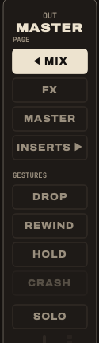

Held gestures last as long as your finger; CRASH, REWIND and PANIC are a single press. Release, and the mix is **exactly** as it was: gestures never touch your mutes or your faders.

Each one works from the keyboard, from the **GESTURES** buttons of the right column, or from the console.

## Drop: only the riddim

<kbd>D</kbd> held, or **DROP**.

Everything is cut except the strips marked **KEEP**. Mark the drums and the bass (click KEEP under each), hold D: you are on the riddim. Release: the whole tune comes back at once.

The KEEP marks are saved in the project.

> **Play it on the bar.** Drop on the first beat, come back four or eight bars later, on the first beat again.

## Throw: one word into the echo

**REC ARM** held on the strip, or the strip's **THROW** button held.

The strip goes at full level into the delay, taken before its fader and its mute. Mute the vocal, throw one word, release: only its echo is left. Works on a snare hit, a horn stab, a guitar chop.

The **Dub throw goes to** menu on the DELAY card sends the throw to the delay, the reverb, or both.

## Hold: the echo loops on itself

<kbd>H</kbd> held, **HOLD**, or **MUTE held on strip 7**.

The delay closes its input and feeds itself back at full. What was in the echo keeps turning, nothing new comes in. Cut everything else (drop, or pull the faders): the loop plays alone. Release: the delay returns to its feedback.

## Crash: hit the spring

<kbd>C</kbd>, or **CRASH**.

A blow on the spring reverb: King Tubby's thunder, Lee Perry's crash. It needs the **Spring** reverb: on the REVERB card, open the menu under its name and choose Spring. On *Plate*, CRASH is greyed out and says so.

Send a little of the drums into the reverb first, so the spring also rings with the riddim.

## Pull-up: rewind the tune

<kbd>R</kbd>, or **REWIND**.

The selector's rewind: the tape brakes on the whole sound (the echoes slow down with it), the tune goes back to the top and plays again.

Between two tunes of a setlist, R pulls up **into the next one**: see [Playing live](../live/).

## Panic: empty the effects

<kbd>Esc</kbd>, or **BANK LEFT + BANK RIGHT** together on the console.

The delay, the reverb and bus 3 are emptied at once, echoes, tails, HOLD and TAPE STOP included. The tune keeps playing, dry. For the echo that howls too long.

## On the effect strips

Strips 7 and 8 have their own held gestures: hold the button on screen, or MUTE / REC ARM on the console.

| Held | Gesture |
|---|---|
| HOLD · MUTE of strip 7 | **HOLD**, as above |
| ×2 · REC ARM of strip 7 | **×2**: the delay goes twice as fast, the echoes jump an octave up, then come back |
| FX ONLY · MUTE of strip 8 | **FX ONLY**: the dry sound leaves, the stems keep feeding the effects: you hear the tune only through its echoes and reverb |
| TAPE STOP · REC ARM of strip 8 | **TAPE STOP**: the delay's tape brakes to a standstill, the echoes collapse; release and it speeds up again |

×2 and TAPE STOP play the built-in delay, not a plugin placed on the delay bus.

## Other keys

| Key | Does |
|---|---|
| <kbd>Space</kbd> | play, pause |
| <kbd>Return</kbd> | back to the top |
| <kbd>L</kbd> | loop the tune |
| <kbd>T</kbd> | tap the tempo |
| <kbd>N</kbd> / <kbd>P</kbd> | next / previous tune of the setlist |
| <kbd>⌘</kbd> <kbd>R</kbd> | record the master |
| <kbd>⌘</kbd> <kbd>S</kbd> | save the project |
| <kbd>⌘</kbd> <kbd>,</kbd> | settings |
