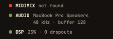

Five minutes, from nothing to a console that answers. You need an **Apple Silicon Mac** (M1 or later) on **macOS 15 or later**. The Akai MIDImix is optional: everything also works with the mouse and the keyboard.

## Install the app

Open the Terminal (Applications ▸ Utilities ▸ Terminal), paste this line and press Return:

```sh
curl -fsSL https://raw.githubusercontent.com/yoanbernabeu/DubStemMix/main/install.sh | sh
```

It downloads the latest release, puts `DubStemMix.app` in `/Applications`, clears the macOS quarantine flag and opens the app. Run the same line again later to update.

**With Homebrew:**

```sh
brew install --cask yoanbernabeu/tap/dubstemmix
```

**By hand, if you prefer:** download `DubStemMix-<version>.zip` from the [releases page](https://github.com/yoanbernabeu/DubStemMix/releases), unzip it and move `DubStemMix.app` to `/Applications`.

## Get past Gatekeeper

DubStemMix is free and has no Apple Developer account behind it, so it is not notarized by Apple. Installed by hand, the first launch may end with macOS saying the app "cannot be opened". Two ways through, once:

- **System Settings ▸ Privacy & Security**, scroll down, click **Open Anyway**.
- Or in the Terminal: `xattr -dr com.apple.quarantine /Applications/DubStemMix.app`

The install script already does the second one for you.

## The first launch

A welcome window sums up the four things to know: plug, SEND ALL, drop stems, play. Click **LET'S GO**. You can reopen it any time from Help ▸ Welcome to DubStemMix.

## Plug in the MIDImix

The MIDImix needs no driver: plug it in USB, before or after opening the app. At the bottom left of the window, the status line says **MIDIMIX connected**.



Then press **SEND ALL** on the console: it sends the position of every knob and fader, and the screen catches up with your hands. Do it each time you plug the console in.

### The console must be on its factory mapping

DubStemMix expects the MIDImix as it leaves the factory. If it was ever changed with the **Akai MIDImix Editor**, the app shows **CONSOLE NOT ON FACTORY MAPPING** and the status line says *custom mapping?*. To fix it, open the editor, then **File ▸ New**, then **Send to Hardware**.

### Ghost marks

The knobs of the MIDImix are not motorized. When they get a new job (another page, see [The board](../the-board/)), a knob does nothing until you turn it to the value it now drives. A dashed cream mark shows that value. Once you reach it, the knob takes over. Nothing ever jumps in the middle of a tune.

## Without a console

Everything has a mouse or keyboard equivalent: drag knobs and faders, click MUTE (⌥-click to solo), hold THROW, use the page buttons in the right column and the [keyboard gestures](../gestures/). Plug the console in later: it takes over, with the same ghost marks.

## Updates

At launch, at most once a day, the app asks GitHub whether a newer version exists. Nothing else is sent. When one is out, a banner shows in the top bar, only while playback is stopped:

- **UPDATE** downloads it, replaces the app where it is installed and reopens it.
- **NOTES** opens the release notes.

Turn the daily check off in Settings (⌘,), or check by hand with Help ▸ Check for Updates….

## Remove the app

Drag `DubStemMix.app` to the Trash. The app also keeps:

- the stem separation engine (663 MB), if you downloaded it, in `~/Library/Application Support/DubStemMix/Models`. Settings ▸ Stem separation ▸ Delete removes it;
- your setlists, split stems and recordings, in `Music/DubStemMix` (the stems and recordings folders can be moved in Settings), and your projects wherever you saved them. These are your files: delete them only if you no longer want them.
