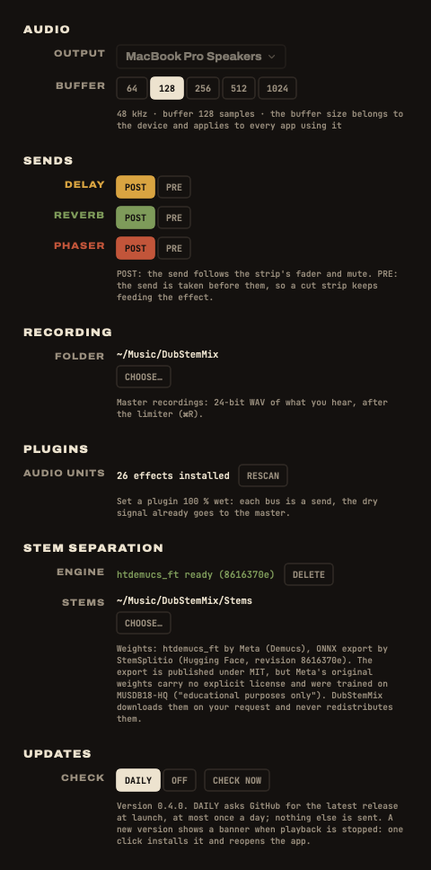

## Settings

Open them with <kbd>⌘</kbd> <kbd>,</kbd>.

| Setting | What it is for |
|---|---|
| **Output device** | the sound card the app plays on |
| **Buffer size** | smaller is more responsive, larger is safer: 128 or 256 samples to play live |
| **Recordings folder** | where ⌘R writes its WAV files |
| **Pre / post fader, per bus** | whether a strip still feeds that effect with its fader down |
| **Audio Units** | rescan the plugins installed on the Mac |
| **Stem separation** | download or delete the engine (663 MB), choose the stems folder |
| **Updates** | daily check on or off, or check now |

At the bottom left of the window, the status line shows the console, the sound card and its buffer, the audio load and the dropouts.

## Troubleshooting

### The app "cannot be opened"

macOS blocks apps that are not notarized by Apple. System Settings ▸ Privacy & Security ▸ **Open Anyway**, once. Or install with the one-line script, which takes care of it. See [Install](../install/#get-past-gatekeeper).

### MIDIMIX not found

- Check the USB cable, and try another port.
- The status line updates by itself when the console is plugged in: no need to restart the app.

### "Custom mapping?" or CONSOLE NOT ON FACTORY MAPPING

The console was reprogrammed with the Akai MIDImix Editor. In the editor: **File ▸ New**, then **Send to Hardware**.

### A knob does nothing

It is waiting to reach its value: after a page change, a knob acts only once it reaches the value it now drives, shown by the dashed ghost mark. Turn it towards the mark. Press **SEND ALL** after plugging the console in.

### No sound

- Is a stem on the strip? Files in **STEMS TO PLACE** do not play.
- Check MUTE, the strip fader and the master fader.
- Check the output device in Settings.
- Is a gesture held? (DROP leaves only the KEEP strips; FX ONLY leaves only the effects.)

### No echo

- The send knob of the strip (top knob, MIX page) is at zero, or the bus is post-fader with the fader down.
- The delay return (fader 7) is down.

### CRASH does nothing

It needs the **Spring** reverb: on the REVERB card, choose Spring in the menu under its name.

### Crackles or dropouts

- Raise the buffer size in Settings (256, then 512).
- The status line counts the dropouts reported by the sound card and shows the audio load.
- Avoid splitting a song while you play: the separation takes all the processor.

### A plugin is missing

The built-in effect stands in and a warning shows. Install the plugin, then rescan in Settings. The plugin stays in the project meanwhile.

### Stems not found

The files were moved or the disk is not plugged in. In a setlist: **LOCATE MISSING STEMS…** and pick the folder that holds them.

## Known limits

- Plugin latency is not compensated: fine on a bus, audible in an insert with a plugin that adds latency.
- Loading or removing a plugin, and putting a stem on a strip or taking one off, would cut the sound for a moment: they are refused while playing. Stop playback first.
- MUTE takes about 25 ms to close.
- macOS 14 and older are not supported. Only macOS 26 has really been tested.
- The Akai MIDImix is the only controller for now.

## FAQ

### Do I need the Akai MIDImix?

No. Everything works with the mouse and the keyboard: knobs, faders, MUTE (⌥-click for solo), THROW, pages, gestures. The console adds the hands.

### What about another controller?

Only the MIDImix today. But the app never talks to the MIDImix directly: the MIDImix is a **profile**, plain data saying which control is which. A controller with the same shape (8 strips with 3 knobs, a fader and buttons, two bank buttons, a master fader), such as the Novation Launch Control XL, can be added by writing its profile. See the [FAQ in the README](https://github.com/yoanbernabeu/DubStemMix#faq), and open an issue or a pull request.

### Does it run on Intel Macs?

The releases are built for Apple Silicon only, and nothing has been tested on Intel. Building from the source code may work, with no promise.

### Which audio files can I load?

WAV, AIFF, FLAC, MP3, M4A and CAF, any sample rate, any length. Several stems can share a strip.

### What about latency?

Set the buffer to 128 or 256 samples. The built-in effects add no latency.

### How does it compare with Ableton Live or DJ software?

They are great at producing or DJing. DubStemMix does one thing: a live dub mix of one tune's stems, ready on the MIDImix. See the comparisons with [Ableton Live](../../compare/ableton-live/), [Logic Pro](../../compare/logic-pro/), [Serato DJ Pro](../../compare/serato-dj-pro/), [Amp FreQQ](../../compare/amp-freqq/) and [the others](../../compare/).

### Is it really free?

Yes, free and open source under the MIT license. The code is on [GitHub](https://github.com/yoanbernabeu/DubStemMix). Bugs and ideas go in the [issues](https://github.com/yoanbernabeu/DubStemMix/issues).
