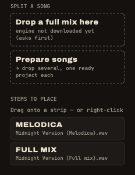

A **stem** is one part of a tune in its own audio file: the drums, the bass, the vocal… DubStemMix plays up to six of them on its six stem strips, and you mix them live. This page covers where stems come from and how to put them on the board.

## Where stems come from

- **Exported from a DAW.** You made the tune, or you have its session: export each track or group as its own file, all starting at the same point.
- **Bought or given as multitracks.** Many labels and artists share stems for remixes and dubs.
- **Split by DubStemMix** from a full song, see below.

Any audio file works: WAV, AIFF, FLAC, MP3, M4A, CAF, any sample rate, any length. Files of different lengths are fine: the longest one sets the length of the tune.

## Put stems on the strips

1. **Drop the folder** (or the files) anywhere in the window. They land in the sidebar under **STEMS TO PLACE**. Non-audio files (an Ableton `.asd`, for instance) are ignored.
2. **Drag each stem onto a strip**, or right-click it ▸ **Place on strip**. A file dropped straight onto a strip goes there.

The app places nothing on its own. A folder that also holds the full mix? Leave that file in the list, or use it for A/B listening.

- **Several stems on one strip**: drop them on the same strip. Kick, snare and hats on strip 1 play together under one fader.
- **Move a stem**: right-click it on its strip ▸ **Move to strip**, or **Back to the stem list**.
- **Strip names** come from the file names, with the shared part removed: "Artist - Tune (Bass)" becomes **BASS**.
- **The tempo** is detected the first time stems land on the strips. Fix it if needed: drag on the value, tap it with <kbd>T</kbd>, or use **÷2 / ×2** (the detector always answers between 58 and 125 BPM, so a fast tune may need ×2). **AUTO** detects again.

Putting a stem on a strip or taking one off is refused while playing (a notice says so): it would leave a gap in the sound. Stop playback first.

## Split a full song

No stems? Drop the song on **Drop a full mix here**, under **SPLIT A SONG** in the sidebar, or use File ▸ Split a Song….

You get a new session with four stems:

| Strip | Stem |
|---|---|
| 1 | drums |
| 2 | bass |
| 3 | instruments (everything else: guitars, keys, horns…) |
| 4 | vocals |

The original song goes into the list for A/B listening, the tempo is detected and the song's name becomes the title.

### The first time

The separation engine is not part of the app. The first split asks before downloading it: **663 MB**, from Hugging Face, once. It lives in `~/Library/Application Support/DubStemMix/Models` and can be removed in Settings.

### How long it takes

The split runs on the processor, with the htdemucs_ft model. Count about **1.2 times the length of the song** on an M3 Pro: a 5-minute tune takes about 6 minutes. It can use up to 9 GB of memory. The sidebar shows which stem is being computed and the time left, and you can cancel.

The stems are written as WAV files in `Music/DubStemMix/Stems` (another folder can be chosen in Settings). A song already split opens again at once, without computing anything.

> **After a split, the instruments share strip 3.** You can still dub them: throw the whole strip into the echo, or cut it on the drop.

## Prepare a whole set at once

Before a session, split ten songs in one go. Drop several songs, or a folder, on **Prepare songs** (under SPLIT A SONG), or use File ▸ Prepare Songs….

- The songs are split **one after the other**. Each one becomes a ready project (`.dubstem`), saved next to its stems: four stems on strips 1 to 4, the original in the list, the tempo, the title. Nothing opens by itself.
- The preparation screen replaces the console while the queue runs, and playback is off. Your open session is not touched.
- You can **drop more songs** on the screen, **remove or reorder** the ones still waiting, or **CANCEL ALL**. Finished songs stay on disk.
- The time left for the whole queue shows at the top.
- A file that fails is marked and the queue moves on.
- At the end, a macOS notification says how many songs are ready.

Then build your set from these projects in the [setlist workshop](../sets/).
