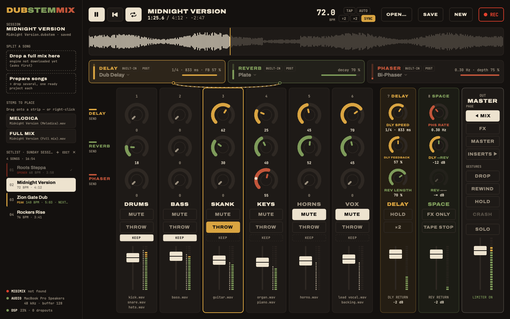
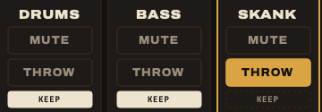
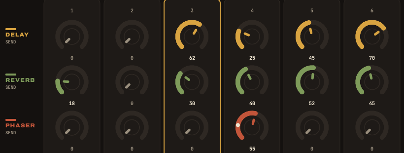
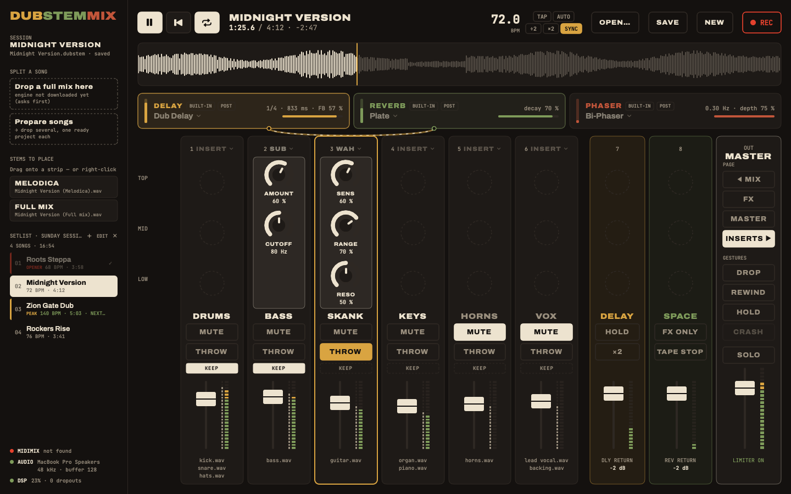
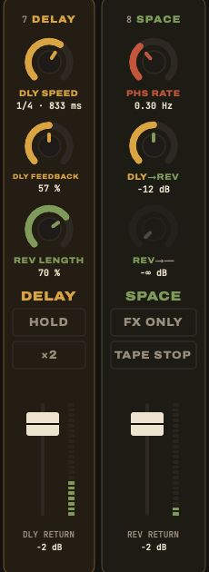
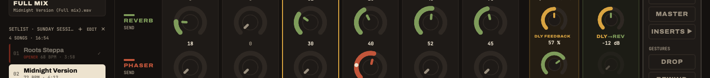

The screen is a mirror of the MIDImix: eight strips and a master, in the same places. What you touch is where you look.

- **Strips 1 to 6** hold the stems.
- **Strips 7 and 8** hold no stem: they play the effects.
- **The right column** is the master: the page buttons, the gestures, the master fader.

## A stem strip

From top to bottom, on strips 1 to 6:

| Control | On the MIDImix | Does |
|---|---|---|
| Three knobs | the three knobs | depend on the page, see below |
| **MUTE** | MUTE | cuts the strip; the LED shows it |
| **SOLO** | hold SOLO, press MUTE (on screen: ⌥-click MUTE) | solos the strip in place: the echo and reverb returns keep playing |
| **THROW** | hold REC ARM | the dub throw: the strip goes at full level into the delay, while held |
| **KEEP** | (on screen) | the strip survives the DROP gesture |
| Fader | the fader | volume of the strip, on every page |

Under the fader, the names of the stems on the strip. Next to the meter, a thin grey bar shows what the stems give **before** the fader and the mute: with the fader down, you still see when the vocal comes in.

### Effects never cut

The delay, the reverb and the phaser sit on **shared buses**, like the sends of a real board. Cutting a strip or pulling its fader down never kills an echo or a reverb tail already on its way. That is the whole point of dub: you cut the vocal, its echo keeps going.

### The throw

Hold THROW (REC ARM on the console): the strip goes at full level into the delay, taken **before** the fader and the mute. So you can throw a strip that is muted and hear only its echo. The **Dub throw goes to** menu on the DELAY card sends the throw to the delay, the reverb, or both.

## The four pages

The faders never change job. The knobs do: **BANK RIGHT** moves to the next page, **BANK LEFT** always comes straight back to MIX. On screen, the page buttons sit in the right column.

| Page | Reach it | The knobs of strips 1 to 6 are |
|---|---|---|
| **MIX** | BANK LEFT | the sends to the delay, the reverb and bus 3 |
| **FX** | BANK RIGHT | the settings of the effects |
| **MASTER** | BANK RIGHT again | the master chain: big knob, kills, dubplate, delay heads |
| **INSERTS** | BANK RIGHT again | each strip's own effect |

After a page change, each knob waits for you to reach its new value (the dashed ghost mark), then takes over.

### MIX: the sends

On each stem strip: the **top knob** sends to the **delay**, the **middle** one to the **reverb**, the **bottom** one to **bus 3** (the phaser, unless you changed it). Sends are taken after the fader by default; Settings can switch any bus to before the fader, for the classic move: fader down, echo still running.

### FX: the effects

Every knob drives a setting of the built-in effects. The header of each strip says which effect.

| Strip | Top | Middle | Bottom |
|---|---|---|---|
| 1 · delay | time | feedback | wow and flutter |
| 2 · delay | low cut | high cut | |
| 3 · reverb | decay | damping | predelay |
| 4 · reverb | low cut | tone | |
| 5 · phaser | rate | depth | resonance |
| 6 · phaser | center | stereo | |
| 7 · returns | delay return | reverb return | bus 3 return |
| 8 · bus to bus | delay → | reverb → | bus 3 → |

The sounds behind these settings are explained in [The effects](../effects/).

### MASTER: the master chain

| Strip | Top | Middle | Bottom |
|---|---|---|---|
| 1 | **big knob** | | |
| 2 | **kill BASS** | **kill MID** | **kill TOP** |
| 3 | **dubplate** | crackle | |
| 4 | delay **heads** | **ping-pong** | |

Strips 5 to 8 have no knob on this page.

### INSERTS: one effect per strip

Each stem strip can hold an effect of its own, between its stems and its fader: a **sub** generator, an **auto-wah**, or an Audio Unit plugin. Choose it from the **Insert** menu of the strip. On this page, the three knobs of the strip drive it.

## The effect strips 7 and 8

They put the effects under your hands without leaving the MIX page: one hand throws the vocal, the other bends the echo.

| | Strip 7 · DELAY | Strip 8 · SPACE |
|---|---|---|
| Top knob | delay speed (ms, or a division with SYNC) | phaser rate |
| Middle knob | delay feedback, up to self-oscillation | delay → its chosen bus |
| Bottom knob | reverb length | reverb → its chosen bus |
| Fader | delay return | reverb return |
| MUTE held | **HOLD**: the delay loops on itself | **FX ONLY**: the dry sound leaves, only the effects remain |
| REC ARM held | **×2**: the delay goes twice as fast | **TAPE STOP**: the delay's tape brakes to a stop |

- These knobs reach the same settings as the FX page: turn the delay speed on strip 7 and the time knob of the FX page follows.
- Their faders hold the returns **on every page**: changing page never changes the sound.
- On the other pages, the knobs of strips 7 and 8 take that page's role (returns and bus-to-bus sends on FX).
- Hold the buttons on screen, or MUTE / REC ARM on the console. HOLD also has its key, <kbd>H</kbd>.

## The master column

- **PAGE**: MIX, FX, MASTER, INSERTS.
- **GESTURES**: DROP, REWIND, HOLD, CRASH. See [Gestures](../gestures/). Under them, **SOLO** clears the solos.
- **The master fader** (the big fader on the right of the MIDImix), its meter, and **LIMITER ON**: the safety limiter. Click it to switch it off; without it, nothing stops the output from clipping above 0 dB, so watch the red top of the meter.

## The top of the window

- **Play, back to the top, loop**: <kbd>Space</kbd>, <kbd>Return</kbd>, <kbd>L</kbd>.
- **The title** (double-click to rename), the position, the length and the time left.
- **The tempo**: drag on it to change it, TAP, AUTO, ÷2 and ×2, **SYNC** to lock the delay to it.
- **OPEN…, SAVE, NEW, REC.**
- **The waveform**: it turns orange in the last 30 seconds. Double-click or ⌥-click to jump (a plain click does nothing while playing, so you never jump by mistake).
- **The effect cards**: DELAY, REVERB and bus 3, with their settings at a glance and their menus. See [The effects](../effects/).
